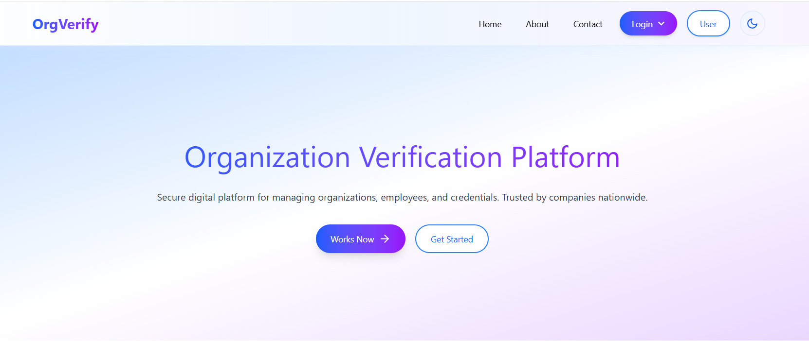

### ☐ OrgVerify
OrgVerify enables secure and verified communication between organizations and clients. It assigns each user a unique Org_ID and ensures complete protection of all client data. The system uses a microservices architecture and a modern React interface to provide fast, reliable data analysis and management.

<p align="center">
  
</p>


- **Authentication & Users**  
  Secure login and access control using `JWT` Tokens for session management, combined with `Google reCAPTCHA` to block automated attacks and ensure only genuine users can authenticate.

- **Unique Org_ID Assignment**  
  Each user receives a distinct `Org_ID`, creating a trusted digital identity used across the platform.

- **Data Protection & Encryption**  
  Sensitive data including (user details, chat logs, and verification history) is protected with encryption and secure storage practices.

- **Real-time Client Chat & Notification**  
  Enables secure and verified messaging between Admins and clients. All messages are encrypted to ensure authenticated interactions without impersonation.

- **Data Analysis & Management**  
  Tools for reviewing verification records, monitoring activity trends, and managing organization/user data for better insights.

- **Microservices Architecture**  
  Modular backend services (`id_server` and `main_server`) for scalability, fault isolation, and independent deployment of components.

- **React Interface & Theme**  
  Fast, responsive, and intuitive UI built with `React.js` for a smooth experience across devices.


### ☐ Toolkit

- **Frontend:** React.js, Vite.js, Tailwind CSS, Framer Motion, Axios
- **Backend:** Node.js, Express.js, MongoDB Cloud, Socket.IO
- **Id_Server:** Node.js, Express.js, MongoDB Cloud
- **Security:** Helmet.js, Express.js (Rate-Limit), CORS, JWT
 
### ☐ Project Structure
```Java
    OrgVerify/
    │
    ├── server/                 # Main Node.js Server
    │   ├── api/
    │   ├── config/
    │   ├── controllers/
    │   ├── data/
    │   ├── middleware/
    │   ├── models/
    │   ├── public/
    │   ├── routes/
    │   ├── uploads/
    │   ├── utils/
    │   ├── .env
    │   ├── package.json
    │   └── server.js
    │
    ├── client/                
    │   ├── src/
    │   │   ├── admin/
    │   │   ├── assets/
    │   │   ├── chat/
    │   │   ├── company/
    │   │   ├── components/
    │   │   ├── pages/
    │   │   └── user/
    │   ├── public/
    │   ├── .env
    │   ├── package.json
    │   └── ...
    │
    ├── id_server/              # Microservice Node.js Server
    │   ├── config/
    │   ├── controllers/
    │   ├── data/
    │   ├── models/
    │   ├── routes/
    │   ├── uploads/
    │   ├── utils/
    │   ├── .env
    │   ├── idServer.js
    │   └── package.json
    │
    └── .gitignore
```

### ☐ Installation
1. **Client**
```bash
cd client
npm install
npm run dev
```
Runs on http://localhost:5173

2. **Server**
```bash
cd server
npm install
npm run dev
```
Runs on http://localhost:5000

3. **Id Server**
```bash
cd id_server
npm install
npm run dev
```
Runs on http://localhost:7000

4. **Environment setup**

Create client/.env
```bash
VITE_BACKEND_URL=
VITE_ORG_ID_URL=

VITE_AUTH_ROUTE=
VITE_ADMIN_ROUTE=
VITE_CHAT_ROUTE=

VITE_RECAPTCHA_SITE_KEY=
```
Create server/.env
```bash
MONGO_URI=
PORT=5000
NODE_ENV=development/production
JWT_SECRET=
JWT_EXPIRE=

ORG_ID_SERVER_URL=
CLIENT_URL=

GOOGLE_CLIENT_ID=your_google_client_id_here
GOOGLE_CLIENT_SECRET=your_google_client_secret_here

APP_NAME=
ADMIN_EMAIL=admin@orgverify.com
EMAIL_SERVICE=Gmail
EMAIL_USER=user@gmail.com
EMAIL_PASS=
SUPPORT_EMAIL=support@gmail.com
CODE_EXPIRY_HOURS=24

RESET_PAGE_URL=
RECAPTCHA_SECRET_KEY=
```
Create id_server/.env
```bash
MONGODB_ORG_ID_URI=
PORT=7000
NODE_ENV=development/production
CORS_ORIGIN=_,_
```

### ☐ Contributing
Open to contributions!
```bash
git clone https://github.com/harshkunz/OrgVerify
```
- Fork the repository  
- Create a new branch (`git checkout -b feature-name`)  
- Commit your changes (`git commit -m 'Add feature'`)  
- Push to the branch (`git push origin feature-name`)  
- Create a Pull Request

